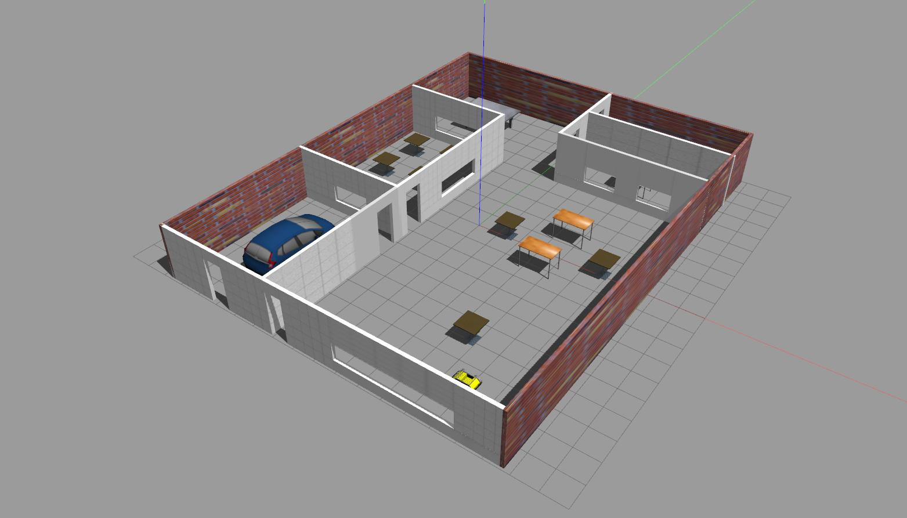
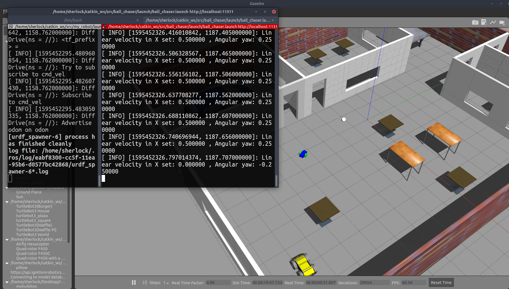
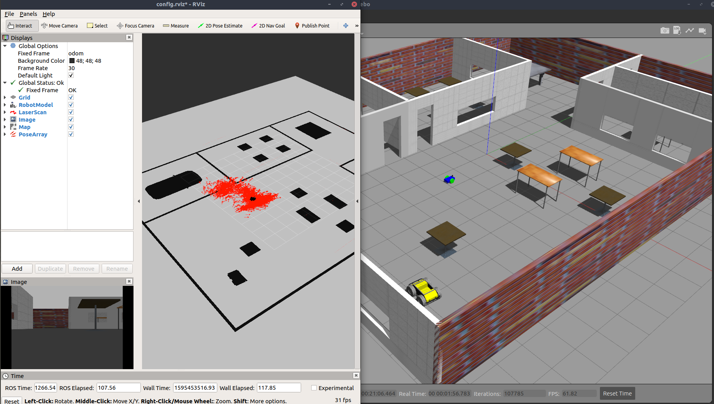
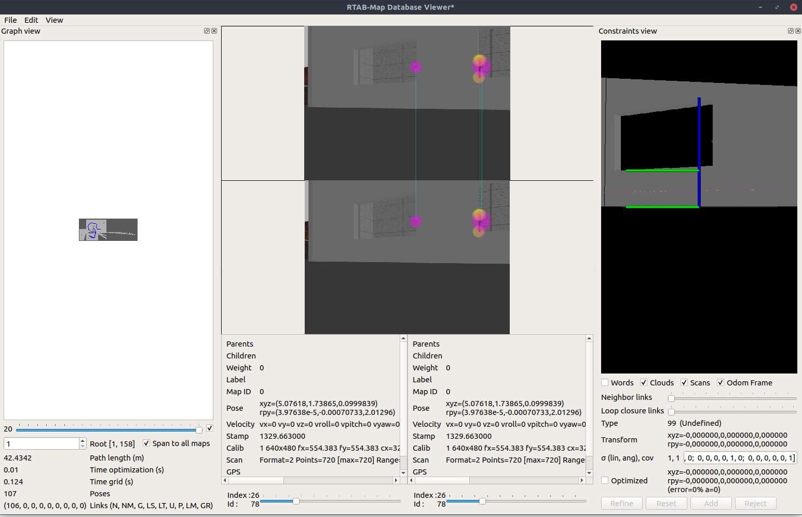
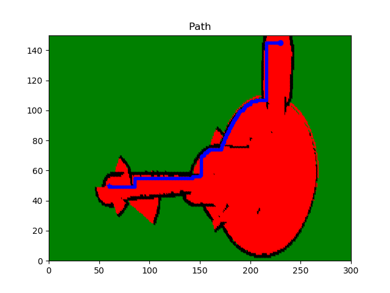

# Robotics Software Engineer Nanodegree Projects

This repository is intended to be used as a start-point for future robotics-based projects. All the content is based in the [Nanodegree program](https://www.udacity.com/course/robotics-software-engineer--nd209) provided by Udacity. 

## Description

The content of this repository is divided in different sub-folders where each one contains a specific topic. The following description will describe the content of each folder.

 - [**Gazebo Basics**](https://github.com/MikeS96/robotics_software_nd/tree/master/gazebo_basics): This folder contains the basic steps to start working with Gazebo, how to use the model and building editor, plugins in Gazebo and more.
	 - **myrobot**: Custom package to understand the workflow of Gazebo.
	 - **project1**: Gazebo package with a world created using the building editor.
	 

 - [**ROS essentials**](https://github.com/MikeS96/robotics_software_nd/tree/master/ros_essentials): Essential elements of robotics, Introduction to ROS, subscribers, publishers, services, among others.
	 - **simple_arm**: Interacting with a robotic arm and creating nodes with publisher, subscribers and services to operate based on the current image obtained.
	 - **chase_it**: ROS package with a wheeled robot in a custom Gazebo world that chases a white ball, modifying the wheels' speed.

 - **[Localization](https://github.com/MikeS96/robotics_software_nd/tree/master/localization)**: The Kalman Filter (KF), Extended Kalman Filter (EKF) and robot pose relative to a known map with Monte Carlo Localization (MCL).
	 - **kalman_filters**: Step-by-step implementation of a Kalman Filter in C++ from the motion update to measurement update in 1d and multiple dimensions.
	 - **kf_lab**: Used the robot pose EKF ROS package to fuse IMU and Odometry data. The output of this package is the pose of the robot. 
	 - **mcl**: Monte Carlo localization with particle filters and computation of belief in C++.
	 - **mcl_lab**: Implementation of the MCL algorithm in a 2d world using C++.
	 - **where_am_i**: Used the Adaptative Monte Carlo Localization to drive a wheeled robot in a previously maped world.

 - [**Mapping and SLAM**](https://github.com/MikeS96/robotics_software_nd/tree/master/mapping_slam): Ocuppancy grid algorithm and different variants of the SLAM algorithm. 
	 - **occupancy_grid_mapping**: Implemented the Ocuppancy grid mapping algorithm in C++ and a simple way to fuse maps from multiple sensor sources.
	 - **gridbased_fastslam**: Used the gmapping ROS package to map a simple environment. This package is based on the Grid-based FastSLAM algorithm.
	 - **map_my_world**: Usage of RTAB-Map SLAM (Graph SLAM) to map a custom world.
 

 - [**Path planning and Navigation**](https://github.com/MikeS96/robotics_software_nd/tree/master/path_planning): Implementation of the A* algorithm, classical oath planning techniques and sample-based methods.
	 - **classic_path_planning**: Minkowski sum implementation in C++ with triangular shapes.
	 - **path_planning_lab**: Implementation of the A* algorithm in a real-world environment.

> Note: Some of the folders were directly taken from the Udacity's repository.

